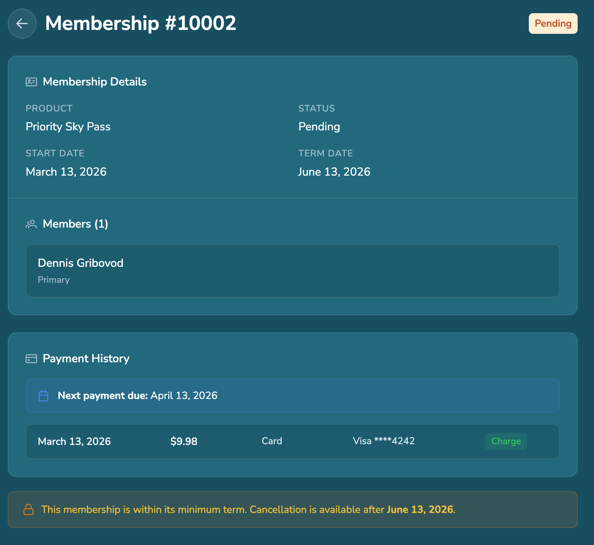
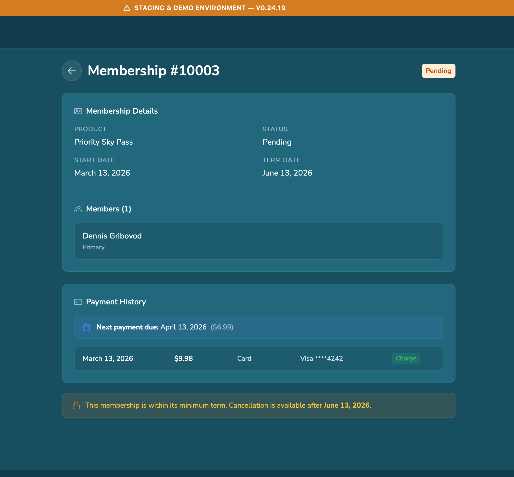

# Bug Report – Invalid Phone Number Accepted in Guest Membership Flow

## Environment

URL:  
https://staging.airtopiaparks.com/guest/explore/memberships

Device:  
Mac mini (Apple M4)

OS:  
macOS

Browser:  
Google Chrome

---

# Summary

The phone number field validation appears incorrect.  
The field accepts up to 16 characters including letters and special characters, and the user can still proceed to the next step with an invalid phone number.

---

# Steps to Reproduce

1. Open the Guest Explore Memberships page.
2. Start the membership signup flow.
3. Enter an invalid phone number (letters or symbols).
4. Continue to the next step.

---

# Actual Result

The form allows the user to proceed even with an invalid phone number.

---

# Expected Result

The system should restrict the phone field to a valid numeric phone format and prevent proceeding until a valid number is entered.

---

# Potential Impact

Users may be able to complete the membership purchase without a valid contact phone number.

This may lead to:

- missing customer contact information
- support issues
- incomplete user profiles

---

# Testing Notes

Payment step was not verified initially due to lack of a test card.

---

# Attachments

### Step 3 – Invalid phone number entered

### Step 4 – System allows proceeding with invalid phone number

---

# Retest Findings – Missing Phone Number and Birth Date Validation

Additional testing was performed to verify whether it is possible to create a Guest account or purchase a membership **without a phone number or birth date**.

Test Card Used:  
4242 4242 4242 4242

---

## Scenario 1 – Profile Editing Bypass

Steps:

1. Create a Guest account.
2. Open the Guest Profile.
3. Remove **Phone Number** and **Birth Date** fields.
4. Continue with the membership purchase process.

### Actual Result

The order was successfully completed **without a Phone Number and Birth Date**.

### Expected Result

Phone Number and Birth Date should be **required fields** before allowing membership purchase or checkout.

---

## Scenario 2 – Guest Widget Validation (Working)

URL:  
https://staging.airtopiapark.com/widget/test.html

Steps:

1. Open the Guest Widget.
2. Select **Priority SkyPass**.
3. Click **Continue**.
4. Leave **Phone Number** and **Birth Date** empty.

### Actual Result

The system **does not allow proceeding** to the next step without filling these fields.

### Result

Validation **works correctly in this flow**.

---

## Scenario 3 – New Account Flow (Safari)

Steps:

1. Open the site in **Safari**.
2. Create a **new Guest account**.
3. Purchase a membership.
4. Leave **Phone Number** and **Birth Date** empty.
5. Complete the order.

### Actual Result

Membership purchase was completed **without Phone Number and Birth Date**.

### Expected Result

Phone Number and Birth Date should be **required for account creation or membership purchase**.

# Retest Screenshots

### Profile without phone number and birth date

### Guest widget validation

### Safari membership purchase

---

# Conclusion

Validation behavior appears **inconsistent across different flows**:

| Flow | Validation |
|-----|-----|
Guest Widget | Works correctly |
Profile Editing | Validation bypass possible |
New Account (Safari) | Validation bypass possible |

This suggests that **backend validation may not be consistently enforced** and some flows rely only on frontend validation.
